A python scirpt that uses classes and csv files to create a secret santa exchange and email participants their assignments

### Development

To seed your local database, run app/db/initdb.py

To start the server
`fastapi dev main.py`

htmx and alpine.js in the front end

#### Schema Diagram

```mermaid
erDiagram
    EXCHANGES {
        int id PK
        string name "not null"
    }

    SANTAS {
        int id PK
        string name "not null"
        string email "not null, unique"
        string parentName
    }

    SANTAEXCHANGEPARTICIPATION {
        int id PK
        int exchangeID FK "not null"
        int santaID FK "not null"
        bool isAdmin
    }

    SANTARESTRICTIONS {
        int id PK "these santas won't be assigned each other"
        int santa1ID FK "not null, CHECK (santa1ID < santa2ID), UNIQUE(santa1ID, santa2ID)"
        int santa2ID FK "not null"
    }

    EXCHANGERUNS {
        int id PK
        int exchangeID FK "not null"
        datetime createdAt "not null"
    }

    EXCHANGEASSIGNMENTS {
        int id PK
        int exchangeRunID FK "not null"
        int santaID FK "not null"
        int gifteeSantaID FK "not null"
    }
```

